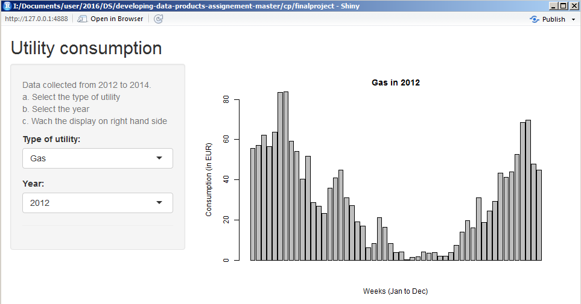

```{r setup, include=FALSE}
knitr::opts_chunk$set(echo = FALSE)
```

## Introduction

The shiny app under development allows a user to select type of utility and the year to display the consumption information



## Utility

- Gas
- Electircity
- Water

## R Code to read the data 

```{r echo = TRUE, eval=TRUE}

data <- read.csv("consumption.csv", sep=",", header=T)
colnames(data)[4] <- "Gas"
colnames(data)[7] <- "Electricity"
colnames(data)[10] <- "Water"


```

## 2012 Gas consumption

```{r Gas}

barplot(data[,c("Gas")],
            main=paste("Gas", "in", 2012),
            ylab="Consumption ", ylim=c(0,80),
            xlab="Weeks (Jan to Dec)")

```

## 2012 Electricity consumption

```{r Electricity}

barplot(data[,c("Electricity")],
            main=paste("Electricity", "in", 2012),
            ylab="Consumption ", ylim=c(0,30),
            xlab="Weeks (Jan to Dec)")

```

## 2012 Water consumption

```{r Water}

barplot(data[,c("Water")],
            main=paste("Water", "in", 2012),
            ylab="Consumption ", ylim=c(0,10),
            xlab="Weeks (Jan to Dec)")

```
